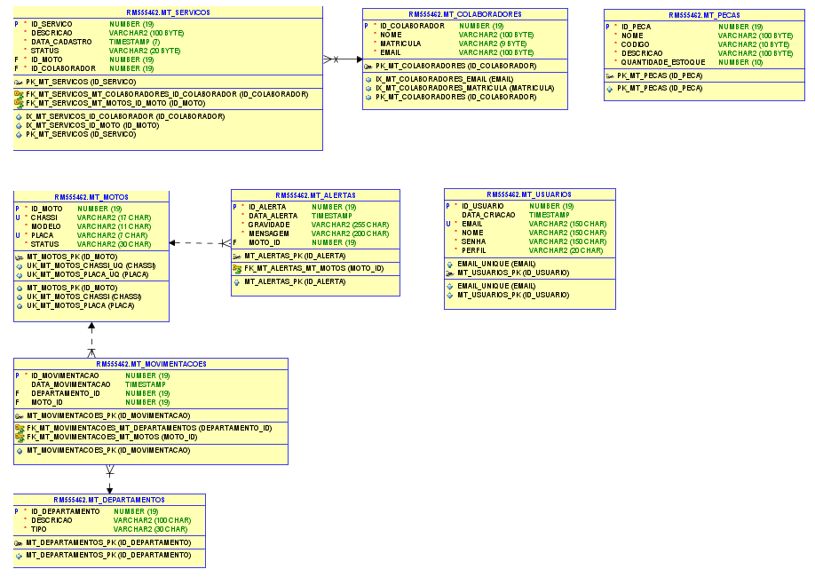

# 🏍️ MotoTrack - Backend API REST (.NET)

## 👥 Integrantes

- **Felipe Ulson Sora** – RM555462 – [@felipesora](https://github.com/felipesora)
- **Augusto Lope Lyra** – RM558209 – [@lopeslyra10](https://github.com/lopeslyra10)
- **Vinicius Ribeiro Nery Costa** – RM559165 – [@ViniciusRibeiroNery](https://github.com/ViniciusRibeiroNery)

## 📌 Sumário

- [📝 Descrição da Solução](#-descrição-da-solução)  
- [🗄️ Modelagem do Banco de Dados](#️-modelagem-do-banco-de-dados)  
- [🚀 Como Rodar o Projeto MotoTrack Completo](#-como-rodar-o-projeto-mototrack-completo)  
- [🧩 Detalhes do Projeto REST API (.NET)](#-detalhes-do-projeto-rest-api-net)  
- [🚀 Como Rodar o Projeto REST API (.NET)](#-como-rodar-o-projeto-rest-api-net)  
- [📹 Demonstração em Vídeo](#-demonstração-em-vídeo)  

## 📝 Descrição da Solução

O **MotoTrack** é um sistema completo desenvolvido para auxiliar empresas de aluguel de motos, como a Mottu, no **controle e monitoramento de sua frota**. 
A aplicação foi criada para resolver problemas comuns de gestão, como a desorganização nos pátios, dificuldade em localizar motos disponíveis ou em manutenção, 
e a falta de histórico rastreável de movimentações e serviços.

O sistema também oferece funcionalidades para **gerenciamento de serviços e manutenções**, vinculando cada atividade a um **colaborador responsável**
, além de permitir o **controle de estoque de peças**, garantindo reposição eficiente e visibilidade dos recursos da empresa.

### O sistema permite:
- 📝 **Cadastro e gestão de motos**;
- 🏢 **Organização por departamentos**, facilitando a localização de veículos;
- 🔄 **Controle de movimentações**, com histórico detalhado;
- 🛠️ **Gestão de serviços e manutenções**, vinculando responsáveis por cada atividade;
- 👨‍🔧 **Registro de colaboradores** envolvidos nos serviços;
- 📦 **Controle de estoque de peças**;
- 🚨 **Disparo de alertas** para acompanhamento do status das motos.

### Estrutura da Solução
O projeto foi dividido em múltiplos módulos para facilitar **escalabilidade e integração**, cada um com responsabilidades específicas:  

- ⚙️ **Backend REST em Java (Spring Boot)** – gerencia as entidades de **usuário, moto, movimentações e alertas**, utilizando **Spring Security com JWT** para autenticação e autorização.  
- 🖥️ **Backend MVC em Java (Spring MVC)** – oferece as mesmas entidades do backend REST Java, com um **frontend web bonito e funcional**, permitindo cadastro, edição, listagem e exclusão de dados diretamente pelo navegador. Possui **Spring Security** com validação de tipo de usuário (**Administrador** e **Comum**) para controlar o acesso às funcionalidades.
- 🧩 **Backend REST em .NET (ASP.NET Core)** – gerencia as entidades de **moto (somente leitura das tabelas criadas pelo Java), colaboradores, serviços e peças**, integrando funcionalidades complementares ao sistema.  
- 📱 **Frontend Mobile (React Native/Expo)** – consome ambas as APIs (Java e .NET) e disponibiliza **telas de cadastro, edição, exclusão e visualização** das funcionalidades, incluindo serviços, colaboradores e estoque de peças.  
- 🗄️ **Banco de Dados Oracle** – utilizado por todos os backends, com **criação automática de tabelas** ao iniciar os projetos.  

---

## 🗄️ Modelagem do Banco de Dados
Abaixo está a modelagem das tabelas utilizadas pelo sistema:  



---

## 🚀 Como Rodar o Projeto MotoTrack Completo

Para utilizar o **MotoTrack** de forma completa, é necessário rodar simultaneamente três módulos:

1. **⚙️ Backend API REST em Java (Spring Boot)** – fornece os endpoints REST para o sistema.
2. **🧩 Backend API REST em .NET (ASP.NET Core)** – fornece funcionalidades complementares via API.
3. **📱 Frontend Mobile (React Native/Expo)** – aplicação mobile que consome ambas as APIs e exibe todas as funcionalidades, incluindo serviços, colaboradores e estoque de peças.
>O **Backend MVC em Java (Spring MVC)** pode ser executado separadamente. Ele permite:
> - **📝 Login e cadastro de usuários;**
> - **🏍️ Cadastro, listagem, edição e exclusão de motos;**
> - **🔄 Cadastro, listagem e exclusão de movimentações e alertas.**

### 🛠️ Passo a Passo

1. Clone todos os repositórios:  
   - [API Rest Java](https://github.com/mototrack-challenge/mototrack-backend-rest-java)  
   - [API Rest .NET](https://github.com/mototrack-challenge/mototrack-backend-rest-dotnet)  
   - [Mobile](https://github.com/mototrack-challenge/mototrack-frontend-mobile)  
   - [MVC Java](https://github.com/mototrack-challenge/mototrack-backend-mvc-java)

2. 🔌 Configure as credenciais de conexão com o banco Oracle nos arquivos de configuração dos backends, se necessário.
    - ✅ O banco de dados e as tabelas serão **criados automaticamente** ao iniciar os backends (Java REST, Java MVC e .NET)

3. 🚀 Rode os backends
    - Java REST: `mvn spring-boot:run` ou rode pelo IDE favorito 
    - .NET REST: `dotnet run` ou abra no Visual Studio

4. 📱 Rode o frontend mobile:
    - Navegue até a pasta do projeto e execute `npm install` para instalar dependências  
    - Execute `npx expo start` para abrir o app no emulador ou dispositivo físico

> ⚠️ Dica: primeiro inicie os backends para que o mobile consiga se conectar às APIs corretamente

5. 🖥️ Para testar o **MVC Java**, basta executar o projeto normalmente; ele funciona isoladamente, sem depender dos outros módulos

---

## 🧩 Detalhes do Projeto REST API (.NET)

O **MotoTrack REST API .NET** é o módulo backend desenvolvido com **ASP.NET Core**, responsável por complementar o sistema com funcionalidades voltadas para **colaboradores, serviços e peças**.  
Ele consome as informações de **motos** já cadastradas no módulo Java (somente leitura), garantindo integração entre os dois backends.

### 🛠️ Tecnologias e Dependências
O projeto utiliza as seguintes tecnologias e bibliotecas principais:  
- **.NET 8.0 (ASP.NET Core Web API)**  
- **Entity Framework Core** – integração com o **Oracle Database**    
- **Swagger** – documentação interativa da API  
- **Dependency Injection (DI)** – para organização de serviços e repositórios

### 🚀 Rodando o Projeto
- A API roda em: [http://localhost:5073/](http://localhost:5073/)  
- O **Swagger** para testes interativos está disponível em: [http://localhost:5073/swagger/index.html](http://localhost:5073/swagger/index.html)

### 📝 Funcionalidades
A API permite realizar operações de **criação, leitura, atualização e exclusão** para as seguintes entidades:
- 🏍️ **Motos** (somente leitura – obtidas do backend Java)
- 👨‍🔧 **Colaboradores**  
- 🛠️ **Serviços** (vinculados a motos e colaboradores)  
- 📦 **Peças** (com controle de estoque)  

### 🌐 Exemplos de Endpoints

#### 🏍️ Moto (somente leitura)

- `GET - /motos`  
  Lista todas as motos (dados obtidos do backend Java).  

- `GET BY ID - /motos/{id}`  
  Lista os detalhes da moto com este id.

#### 👨‍🔧 Colaborador

- `POST - /api/Colaborador`  
  Cadastra um novo colaborador.

```jsonc
{
  "nome": "Carlos Souza",
  "matricula": "620184901",
  "email": "carlos@mototrack.com"
}
```

- `GET - /api/Colaborador`  
  Lista todos os colaboradores cadastrados.

- `GET BY ID - /api/Colaborador/{id}`  
  Lista o colaborador cadastrado com este id.

- `PUT - /api/Colaborador/{id}`  
  Atualiza os dados do colaborador com este id.

```jsonc
{
  "nome": "Carlos Silva", // alterando nome
  "matricula": "620184901",
  "email": "c.silva@mototrack.com" // alterando email
}
```

- `DELETE - /api/Colaborador/{id}`  
  Remove o colaborador com este id.

#### 🛠️ Serviço

- `POST - /api/Servico`  
  Cadastra um novo serviço, vinculando uma moto e um colaborador.

```jsonc
{
  "descricao": "Troca de óleo",
  "status": "Pendente",
  "motoId": 1,
  "colaboradorId": 1
}
```

- `GET - /api/Servico`  
  Lista todos os serviços cadastrados.

- `GET BY ID - /api/Servico/{id}`  
  Lista os detalhes do serviço com este id.

- `PUT - /api/Servico/{id}`  
  Atualiza os dados de um serviço com este id.

```jsonc
{
  "descricao": "Troca de óleo + filtro", // alterando descrição
  "status": "Concluido", // alterando status
  "motoId": 1,
  "colaboradorId": 1
}
```

- `DELETE - /api/Servico/{id}`  
  Remove o serviço com este id.

#### 📦 Peça

- `POST - /api/Peca`  
  Cadastra uma nova peça no estoque.

```jsonc
{
  "nome": "Filtro de Óleo",
  "codigo": "PF456",
  "descricao": "Filtro de óleo compatível com as motos",
  "quantidadeEstoque": 30
}
```

- `GET - /api/Peca`  
  Lista todas as peças em estoque.

- `GET BY ID - /api/Peca/{id}`  
  Lista os detalhes da peça com este id.

- `PUT - /api/Peca/{id}`  
  Atualiza os dados de uma peça no estoque.

```jsonc
{
  "nome": "Filtro de Óleo",
  "codigo": "PF456",
  "descricao": "Filtro de óleo compatível com as motos",
  "quantidadeEstoque": 25 // alterando quantidade
}
```

- `DELETE - /api/Peca/{id}`  
  Remove a peça com este id.

--- 

## 🚀 Como Rodar o Projeto REST API (.NET)

Para executar o **MotoTrack REST API .NET**, siga os passos abaixo:

### 1️⃣ Rodar o Backend Java Primeiro
- Antes de iniciar a API .NET, certifique-se de que o **MotoTrack REST API Java** está rodando no **localhost:8080**.  
- Isso é necessário porque a API .NET **consome os dados das motos** cadastradas pelo backend Java (somente leitura).


### 2️⃣ Configurar o Banco de Dados
- Abra o arquivo de configuração do projeto (`appsettings.json`) e configure as **credenciais de acesso ao Oracle** (usuário, senha e URL).  
- Verifique se o banco está ativo e acessível.

### 3️⃣ Aplicar Migrations
- Abra o **Package Manager Console** no Visual Studio ou utilize o terminal do .NET.  
- Execute o comando abaixo para criar o banco de dados e aplicar as **migrations**:

```bash
Update-Database
```

> ⚠️ Esse comando cria as tabelas do projeto conforme as migrations definidas.

### 4️⃣ Executar o Projeto
- Abra o projeto no **Visual Studio**.  
- Clique no **ícone de play** ou pressione `F5` para iniciar o servidor.
- O projeto será iniciado no **localhost:5073**.

### 5️⃣ Acessar a Aplicação
- Abra o navegador e acesse a URL principal da API: [http://localhost:5073/](http://localhost:5073/)
- Para documentação interativa via Swagger, acesse: [http://localhost:5073/swagger/index.html](http://localhost:5073/swagger/index.html)

> ⚠️ Dica: Primeiro configure o banco e aplique as migrations para evitar erros de inicialização. Certifique-se de que a porta 5073 não está sendo usada por outro processo.

---

## 📹 Demonstração em Vídeo

Para ver o **MotoTrack REST API .NET** em funcionamento, assista ao vídeo abaixo, onde o projeto é executado e suas principais funcionalidades são demonstradas:  

🎥 [Assista à demonstração completa](https://youtu.be/g3j63Uh33J8)  

No vídeo, você verá:  
- Consulta das **motos** cadastradas no backend Java (somente leitura)  
- Cadastro, edição, listagem e exclusão de **colaboradores**  
- Cadastro, edição, listagem e exclusão de **serviços** vinculados a motos e colaboradores  
- Cadastro, edição, listagem e exclusão de **peças** no estoque  
- Uso do **Swagger** para testar e interagir com os endpoints da API